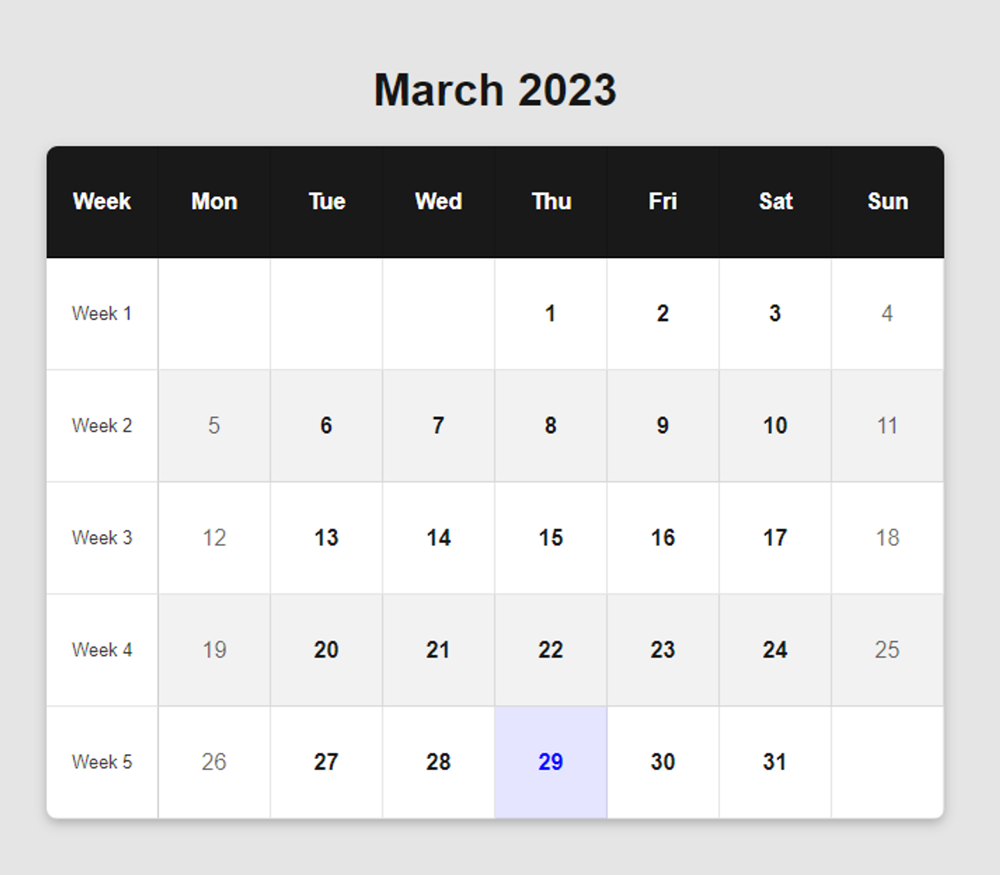

# Loops

This particular challenge presented us with a significant problem-solving task. The calendar code we were given was riddled with errors, and it required us to step outside of our comfort zones in order to rectify the issues at hand. Ultimately, this experience was a valuable exercise in both critical thinking and coding, as was able to overcome a complex set of obstacles and achieve a successful outcome.

## Task

In the following exercise, you will be required to create a calendar that automatically calculates the current month and day and displays all dates in a grid format.

Note that you will need to organise days in a table by their corresponding day of the week and the week in that month. You are supplied with both an index.html and styles.css file and are not allowed to change these.

You are also supplied with a scripts.js file. Note that you are only allowed to change the code between the two comments. In other words, you will primarily update the following functions:

createData createCell createHtml At the moment the code is broken. However, apply everything you’ve learned thus far about JavaScript to have the table render the current month you are in (dynamically) as in the example below (however note that you are most likely in a different month and not March 2023).

Note that you should also highlight the current day in blue.

</img>
## Deployment

To deploy this project open a [live server](https://marketplace.visualstudio.com/items?itemName=ritwickdey.LiveServer) in VSCode

